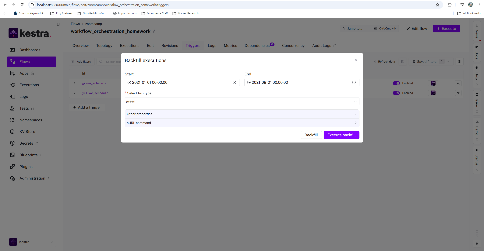
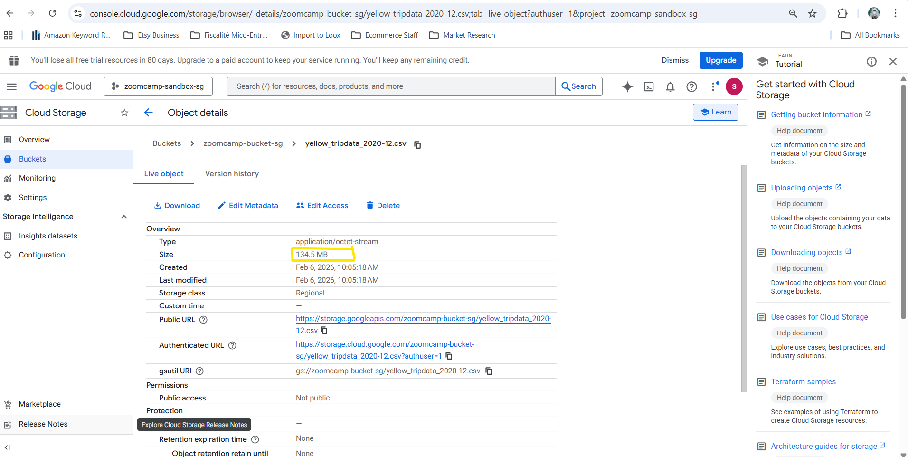
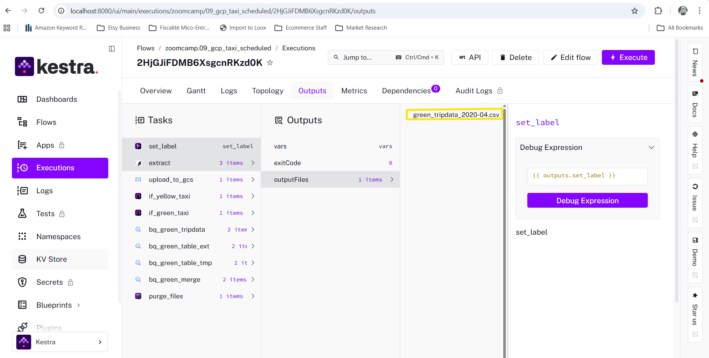
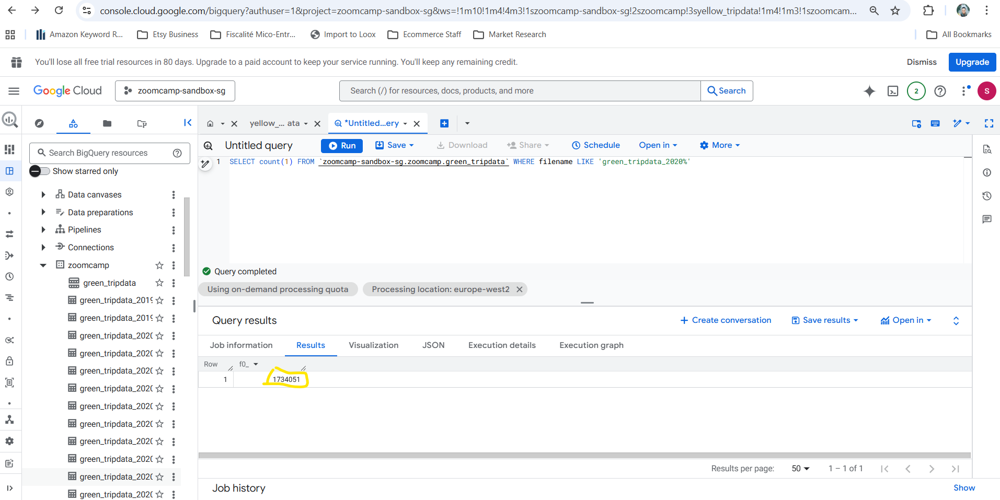
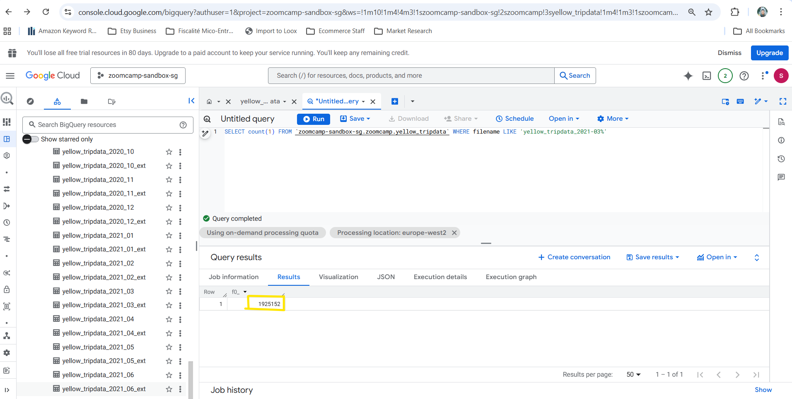

### Module 2 Homework — Workflow Orchestration (Kestra)

Homework link: [02-workflow-orchestration/homework.md](https://github.com/DataTalksClub/data-engineering-zoomcamp/blob/main/cohorts/2026/02-workflow-orchestration/homework.md)

This README contains:
- Evidence of backfilling 2021 data for **yellow** and **green** taxi datasets
- Answers to the **6 quiz questions**, with screenshots

#### Evidence screenshots (Backfill + BigQuery tables)

**Backfill Yellow (2021-01-01 → 2021-07-31)**  

**Backfill Green (2021-01-01 → 2021-07-31)**  

**BigQuery tables after loading 2021 data (Yellow + Green present)**  

**BigQuery green_tripdata table (schema view)**  

### Quiz Answers

#### Q1) Uncompressed file size for Yellow Taxi `2020-12` (`yellow_tripdata_2020-12.csv`)
**Answer:** `134.5 MiB`  

#### Q2) Rendered value of `file` for `taxi=green`, `year=2020`, `month=04`
**Answer:** `green_tripdata_2020-04.csv`  

#### Q3) Rows for Yellow Taxi data for all CSV files in year 2020
**Answer:** `24,648,499`  

#### Q4) Rows for Green Taxi data for all CSV files in year 2020
**Answer:** `1,734,051`  

#### Q5) Rows for Yellow Taxi data for March 2021
**Answer:** `1,925,152`  

#### Q6) Configure timezone to New York in a Schedule trigger
**Answer:** Add a `timezone` property set to `America/New_York`  

### Notes
- Backfill period used: `2021-01-01` to `2021-07-31` (as instructed).
- The flow was executed for both taxi types (`yellow` and `green`) using Kestra backfill.
