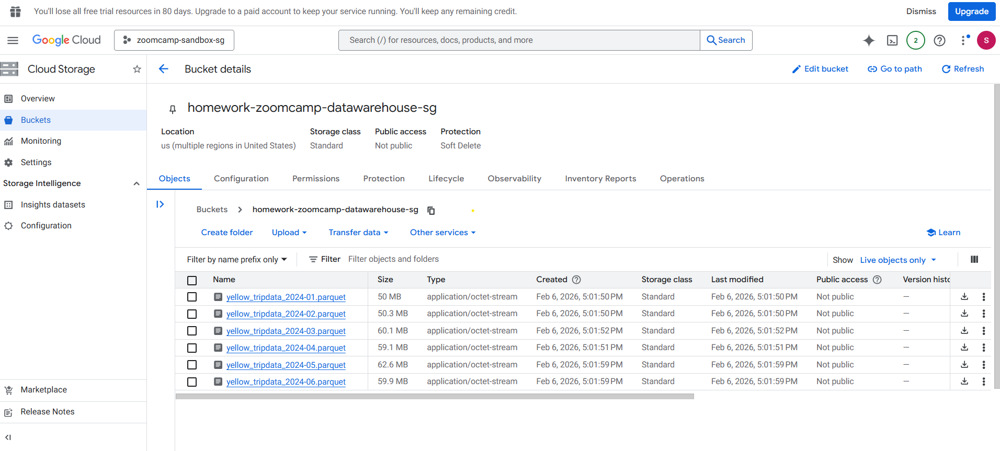
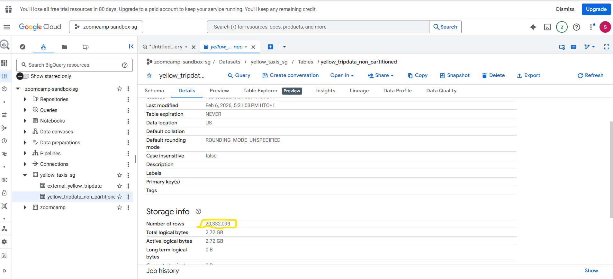
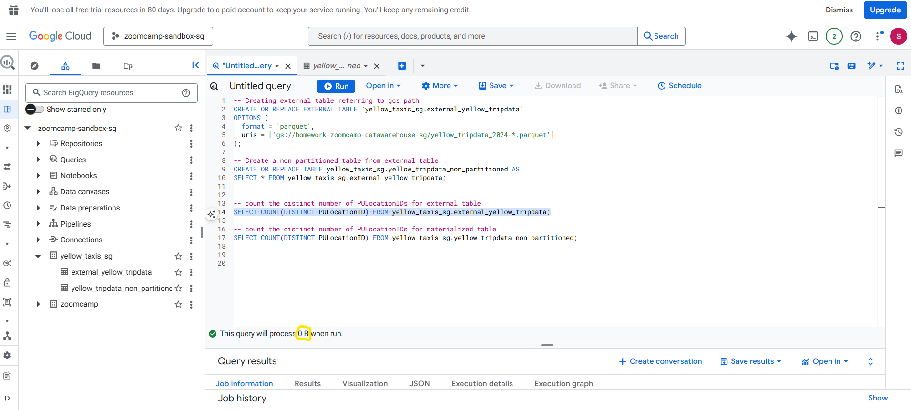
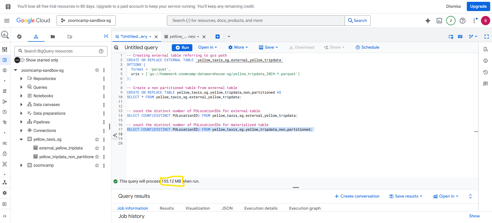
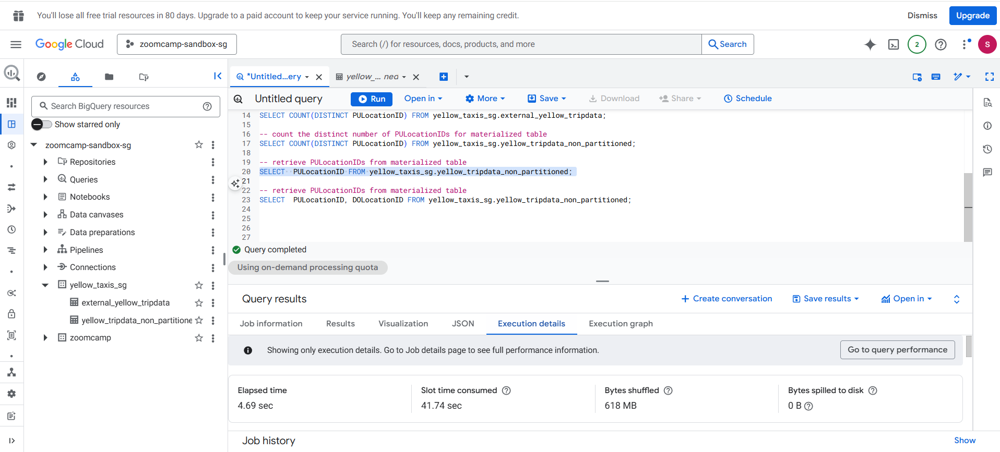
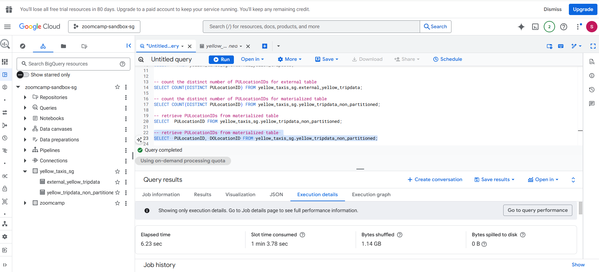
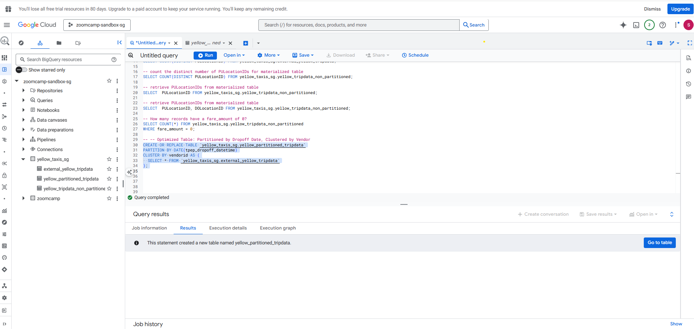

# Module 3 Homework: Data Warehousing & BigQuery

## Setup

### Data Loading
Loaded Yellow Taxi Trip Records for January 2024 - June 2024 from NYC TLC website into GCS bucket `homework-zoomcamp-datawarehouse-sg`.




### BigQuery Setup

#### External Table
Created external table referencing GCS path:

```sql
-- Creating external table referring to gcs path
CREATE OR REPLACE EXTERNAL TABLE `yellow_taxis_sg.external_yellow_tripdata`
OPTIONS (
  format = 'parquet',
  uris = ['gs://homework-zoomcamp-datawarehouse-sg/yellow_tripdata_2024-*.parquet']
);
```

#### Materialized Table
Created a non-partitioned table from external table:

```sql
-- Create a non partitioned table from external table
CREATE OR REPLACE TABLE yellow_taxis_sg.yellow_tripdata_non_partitioned AS
SELECT * FROM yellow_taxis_sg.external_yellow_tripdata;
```


---

## Question 1. Counting records

**Question:** What is count of records for the 2024 Yellow Taxi Data?

**Query:**
```sql
-- count the distinct number of PULocationIDs for materialized table
SELECT COUNT(DISTINCT PULocationID) FROM yellow_taxis_sg.yellow_tripdata_non_partitioned;
```

**Answer:** **20,332,093**




---

## Question 2. Data read estimation

**Question:** Write a query to count the distinct number of PULocationIDs for the entire dataset on both the tables. What is the **estimated amount** of data that will be read when this query is executed on the External Table and the Table?

**Queries:**
```sql
-- count the distinct number of PULocationIDs for external table
SELECT COUNT(DISTINCT PULocationID) FROM yellow_taxis_sg.external_yellow_tripdata;

-- count the distinct number of PULocationIDs for materialized table
SELECT COUNT(DISTINCT PULocationID) FROM yellow_taxis_sg.yellow_tripdata_non_partitioned;
```


**Answer:** **0 MB for the External Table and 155.12 MB for the Materialized Table**





---

## Question 3. Understanding columnar storage

**Question:** Write a query to retrieve the PULocationID from the table (not the external table) in BigQuery. Now write a query to retrieve the PULocationID and DOLocationID on the same table. Why are the estimated number of Bytes different?

**Queries:**
```sql
-- retrieve PULocationIDs from materialized table
SELECT PULocationID FROM yellow_taxis_sg.yellow_tripdata_non_partitioned;

-- retrieve PULocationIDs from materialized table
SELECT PULocationID, DOLocationID FROM yellow_taxis_sg.yellow_tripdata_non_partitioned;
```


**Answer:** **BigQuery is a columnar database, and it only scans the specific columns requested in the query. Querying two columns (PULocationID, DOLocationID) requires reading more data than querying one column (PULocationID), leading to a higher estimated number of bytes processed.**





---

## Question 4. Counting zero fare trips

**Question:** How many records have a fare_amount of 0?

**Query:**
```sql
-- How many records have a fare_amount of 0?
SELECT COUNT(*) FROM yellow_taxis_sg.yellow_tripdata_non_partitioned
WHERE fare_amount = 0;
```


**Answer:** **8,333**


---

## Question 5. Partitioning and clustering

**Question:** What is the best strategy to make an optimized table in Big Query if your query will always filter based on tpep_dropoff_datetime and order the results by VendorID (Create a new table with this strategy)?

**Query:**
```sql
-- Optimized Table: Partitioned by Dropoff Date, Clustered by Vendor
CREATE OR REPLACE TABLE `yellow_taxis_sg.yellow_partitioned_tripdata`
PARTITION BY DATE(tpep_dropoff_datetime)
CLUSTER BY vendorid AS (
  SELECT * FROM `yellow_taxis_sg.external_yellow_tripdata`
);
```

**Answer:** **Partition by tpep_dropoff_datetime and Cluster on VendorID**

This strategy is optimal because:
- Partitioning by `tpep_dropoff_datetime` allows BigQuery to skip irrelevant partitions when filtering by date
- Clustering by `VendorID` organizes data within each partition for efficient ordering and filtering



---

## Question 6. Partition benefits

**Question:** Write a query to retrieve the distinct VendorIDs between tpep_dropoff_datetime 2024-03-01 and 2024-03-15 (inclusive). Use the materialized table you created earlier in your from clause and note the estimated bytes. Now change the table in the from clause to the partitioned table you created for question 5 and note the estimated bytes processed. What are these values?

**Queries:**

Non-partitioned table:
```sql
-- get Distinct Vendors for Dropoffs in First Half of March 2024 (non partitioned and Clustered Table)
SELECT DISTINCT vendorid FROM `yellow_taxis_sg.yellow_tripdata_non_partitioned`
WHERE DATE(tpep_dropoff_datetime) BETWEEN '2024-03-01' AND '2024-03-15';
```

Partitioned table:
```sql
-- get Distinct Vendors for Dropoffs in First Half of March 2024 (partitioned and Clustered Table)
SELECT DISTINCT vendorid FROM `yellow_taxis_sg.yellow_partitioned_tripdata`
WHERE DATE(tpep_dropoff_datetime) BETWEEN '2024-03-01' AND '2024-03-15';
```

**Answer:** **310.24 MB for non-partitioned table and 26.84 MB for the partitioned table**


---

## Question 7. External table storage

**Question:** Where is the data stored in the External Table you created?

**Answer:** **GCP Bucket**


---

## Question 8. Clustering best practices

**Question:** It is best practice in Big Query to always cluster your data:

**Answer:** **False**

Clustering is not always the best practice. It should be used when:
- You frequently filter or aggregate by specific columns
- Your table is larger than 1 GB
- You have high cardinality columns

For small tables or tables without consistent query patterns, clustering may not provide significant benefits and can add unnecessary complexity.

---

## Question 9. Understanding table scans

**Question:** No Points: Write a `SELECT count(*)` query FROM the materialized table you created. How many bytes does it estimate will be read? Why?

**Query:**
```sql
SELECT count(*) FROM yellow_taxis_sg.yellow_tripdata_non_partitioned;
```

**Result:** **0 B**

**Explanation:** 
The data is already cached in big query from a previous query result


