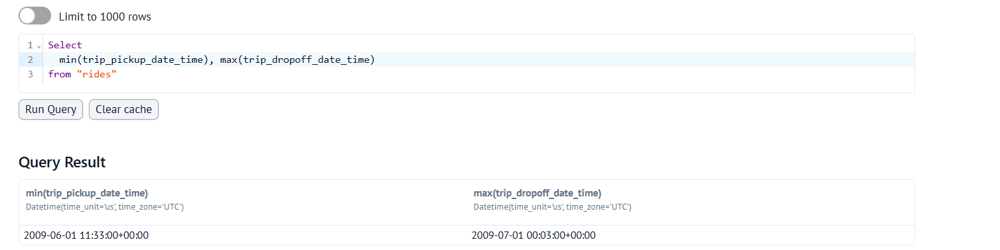
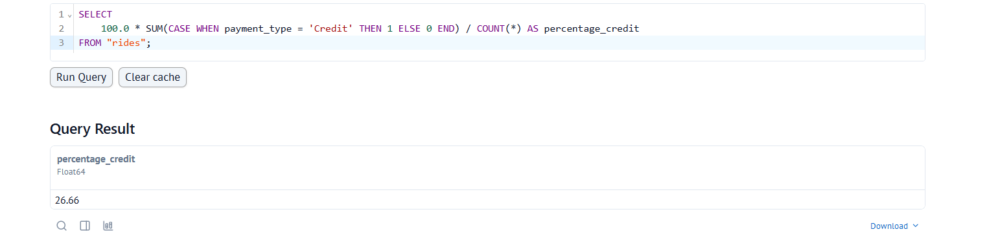
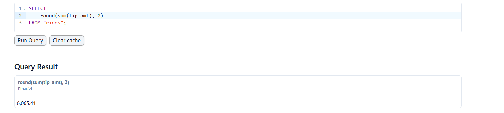

# dlt Homework — NYC Taxi Pipeline (DuckDB)

This repository contains my solution for the dlt homework from Data Engineering Zoomcamp 2026.

Homework instructions:
- https://github.com/DataTalksClub/data-engineering-zoomcamp/blob/main/cohorts/2026/workshops/dlt/dlt_homework.md

## Pipeline summary

- Source: NYC Yellow Taxi trip data (custom REST API)
- Destination: DuckDB
- Pagination: Stop when an empty page is returned
- Table/resource name: `rides`

## Questions & Answers

### Question 1: What is the start date and end date of the dataset?

**SQL:**

```sql
SELECT
  min(trip_pickup_date_time),
  max(trip_dropoff_date_time)
FROM "rides";
```

**Correct option:** **2009-06-01 to 2009-07-01**

**Screenshot:**



---

### Question 2: What proportion of trips are paid with credit card?

**SQL:**

```sql
SELECT
  100.0 * SUM(CASE WHEN payment_type = 'Credit' THEN 1 ELSE 0 END) / COUNT(*) AS percentage_credit
FROM "rides";
```

**Correct option:** **26.66%**

**Screenshot:**



---

### Question 3: What is the total amount of money generated in tips?

**SQL:**

```sql
SELECT
  round(sum(tip_amt), 2)
FROM "rides";
```

**Correct option:** **$6,063.41**

**Screenshot:**


